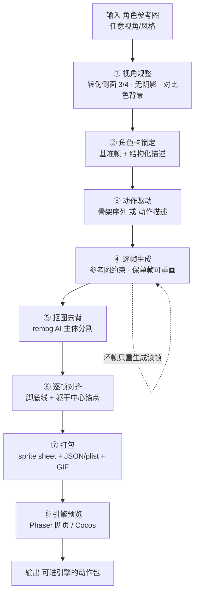

# Windup · 2D 角色动画素材生成管线

从**一张角色参考图**出发，生成**同一个角色的一套走路动作**，抠图去背、逐帧对齐，打包成**可直接进游戏引擎的 sprite sheet**。核心目标不是"生成一张好看的图"，而是把"生成之后、进引擎之前"那段最麻烦的**最后一公里**（视角规整 · 一致性 · 去背 · 对齐 · 打包 · 引擎交付）做成自动流程。

> A pipeline that turns **one character reference** into a **consistent walk-cycle sprite sheet** that drops straight into a game engine — focusing on the "last mile" between AI generation and an engine-ready asset.

---

## 流程图 · Pipeline



**一条硬约束贯穿全流程：单帧可独立重画。** 每一帧都是独立生成、可单独重跑——坏哪帧重画哪帧，不动其他帧。这决定了主线走"参考图 + 逐帧生成"，而不是视频转帧或 3D 渲帧（那两种帧相互耦合，无法单帧重画）。

---

## 已跑通的成果 · Results

### 角色示例：Lirael（像素风 · 伪侧面 · 长裙德鲁伊）

一张正面像素图 → 转伪侧面 → 走路循环 → 抠图 → 进引擎播放。


- 基准帧、走路原图、抠图版、成品：见 [`characters/lirael/`](characters/lirael/)
- 引擎内预览（Phaser 网页）：见 [`preview/`](preview/)

### 可交互预览

本地起服务器打开（**不能双击 `file://`，浏览器会拦本地图片加载**）：

```bash
cd preview
python3 -m http.server 8777
# 浏览器打开 http://localhost:8777/
```

---

## 技术栈 · Stack（当前验证版）

| 环节 | 用什么 |
|---|---|
| 生成 | Gemini flash-image（图像 API，OpenAI 兼容） |
| 抠图 | rembg（u2net）AI 主体分割 |
| 对齐/打包 | Python + Pillow |
| 引擎预览 | Phaser 3（网页运行时）；Cocos Creator（目标，走 MCP 导入） |
| 交付格式 | PNG 图集 · sprite sheet · JSON(TexturePacker) · plist(Cocos) · 逐帧 PNG |

> 这是"验证版"技术栈；产品最终技术栈（核心管线 Python vs TS、丝滑动画是否上云端 ControlNet）仍在评估。

---

## 关键结论 · Lessons（踩坑沉淀）

- **抠图必须用 AI 主体分割（rembg），不能按颜色抠** —— 骨白/绿袍等角色会和纯色背景撞色被抠穿。
- **背景色要避开角色主色** —— 绿袍角色不能用绿幕，改品红等对比色。
- **画布漂移必须逐帧对齐** —— 生成的每帧角色位置/尺寸都不同，按脚底线+躯干中心锚点对齐。
- **视角分正侧面 vs 伪侧面(3/4)** —— 细节角色用伪侧面更好看；但伪侧面左右镜像会"换手/透视反"。
- **本机跑不动本地扩散模型** —— 追求丝滑动画（ControlNet 级）需云端 GPU。
- **动画平滑度不是本项目的核心** —— 核心是"进引擎的最后一公里 + 单帧可重画"。

完整流程演进与试错记录见 [`docs/FLOWLOG.md`](docs/FLOWLOG.md)。

---

## 目录 · Structure

```
characters/<name>/    每个角色一个文件夹
  01_base/            原图 + 侧视候选 + 选定基准帧
  02_walk_raw/        走路原图（未抠）
  03_walk_cutout/     走路抠图版（透明）
  04_output/          walk.gif + sprite_sheet
preview/              Phaser 引擎内预览（本地起服务器打开）
docs/FLOWLOG.md       流程实时记录 + 试错日志
```
