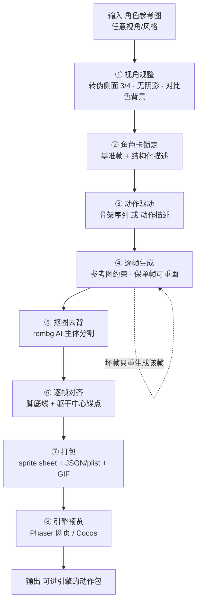
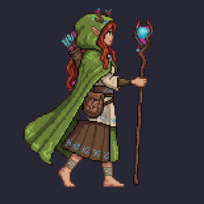

# Windup · 2D 角色动画素材生成管线

从**一张角色参考图**出发，生成**同一个角色的一套走路动作**，抠图去背、逐帧对齐，打包成**可直接进游戏引擎的 sprite sheet**。核心目标不是"生成一张好看的图"，而是把"生成之后、进引擎之前"那段最麻烦的**最后一公里**（视角规整 · 一致性 · 去背 · 对齐 · 打包 · 引擎交付）做成自动流程。

> A pipeline that turns **one character reference** into a **consistent walk-cycle sprite sheet** that drops straight into a game engine — focusing on the "last mile" between AI generation and an engine-ready asset.

---

## 流程图 · Pipeline



**一条硬约束贯穿全流程：单帧可独立重画。** 每一帧都是独立生成、可单独重跑——坏哪帧重画哪帧，不动其他帧。这决定了主线走"参考图 + 逐帧生成"，而不是视频转帧或 3D 渲帧（那两种帧相互耦合，无法单帧重画）。

---

## 已跑通的成果 · Results

### 角色示例：Lirael（像素风 · 伪侧面 · 长裙德鲁伊）

一张正面像素图 → 转伪侧面 → 走路循环 → 抠图 → 进引擎播放。



- 基准帧、走路原图、抠图版、成品：见 [`characters/lirael/`](characters/lirael/)
- 引擎内预览（Phaser 网页）：见 [`preview/`](preview/)

### 可交互预览

本地起服务器打开（**不能双击 `file://`，浏览器会拦本地图片加载**）：

```bash
cd preview
python3 -m http.server 8777
# 浏览器打开 http://localhost:8777/
```

---

## 怎么跑 · Run

```bash
pip install -r requirements.txt          # Pillow + rembg + onnxruntime
export SUFY_KEY=你的图像API_key           # 生成步骤需要（OpenAI 兼容端点）

python run.py --ref path/to/character.png --name mychar \
  --desc "英文角色身份描述，如 pixel-art druid: red hair, green cloak, staff" \
  --mode desc        # desc=动作描述驱动(长裙/复杂角色) | skeleton=骨架驱动(露腿角色)
```

产出在 `characters/mychar/`（01_base → 02_walk_raw → 03_walk_cutout → 04_output）。

- **生成步骤**（视角规整、逐帧生成）需联网 + 有效 `SUFY_KEY`；
- **抠图/对齐/打包**是本地纯 CV，无需联网、无需 key；
- 首次跑 rembg 会自动下载 u2net 模型（~176MB）。

### 一套代码，任意角色（不是每个角色写一套代码）

换角色 = 换参数，不改代码。每个角色 = **一张参考图 + 一个自动生成的角色卡（`card.json`）**：

```bash
python run.py --ref anyone.png --name whoever --actions idle,walk,attack
```

- **角色卡（`character.py`）** 是一致性主键，固化身份描述 + 基准帧 + 版本；
- **描述自动生成（`describe.py`）**：视觉模型看图自动填角色卡，换角色连描述都不用手写；
- **溯源（`provenance.py`）** 记录每次生成的 prompt / 路线 / 次数 / 成本 / 耗时 → 可复现、可核算成本、AIGC 合规标识。
  （注：图像生成有随机性，**流程与参数可复现，非像素级一致** —— 行业常态。）

### 核心卖点：单帧重生成

坏哪帧只重生成那一帧，其余帧不动 —— 逐帧路线相对"视频转帧 / 3D 渲帧"（帧耦合、改一帧动全身）的关键优势：

```bash
python run.py --regen lirael walk 3      # 只重生成 walk 第 3 帧
```

### 自动质检（差异化）

- **对齐漂移**（纯 CV，免费）：跨帧脚底线/躯干中心方差，自动标出漂移帧；
- **一致性**（`--qa-vlm`）：视觉模型逐帧对比基准帧，判"是否同一角色"并列出漂移细节（如"宝珠颜色从蓝漂到粉"）。
- 不合格帧 → 建议 `--regen` 单帧重生成。

### 代码结构

```
pipeline/
  config.py        环境变量读 API key；模型配置
  character.py     角色卡（一致性主键 + 资产库/版本）
  actions.py       动作清单（idle/walk/attack/jump + 自定义）
  describe.py      自动看图生成角色描述
  generate.py      ① 视角规整 + ④ 逐帧生成
  skeleton_gen.py  ③ 走路骨架序列
  matte.py         ⑤ rembg 抠图 + 去脚下阴影
  align.py         ⑥ 逐帧对齐（脚底/躯干锚点）
  qa.py            自动质检（对齐漂移 + VLM 一致性）
  pack.py          ⑦ sprite sheet + JSON + plist + Godot .tres + 尺寸档 + GIF
  provenance.py    生成溯源 + 成本核算
  regenerate.py    单帧重生成
run.py             主流程（生成 / 单帧重生成）
skeleton/          架构空骨架（模块划分 + 接口契约，供架构评审）
```

---

## 技术栈 · Stack（当前验证版）

| 环节 | 用什么 |
|---|---|
| 生成 | Gemini flash-image（图像 API，OpenAI 兼容） |
| 抠图 | rembg（u2net）AI 主体分割 |
| 对齐/打包 | Python + Pillow |
| 引擎预览 | Phaser 3（网页运行时）；Cocos Creator（目标，走 MCP 导入） |
| 交付格式 | PNG 图集 · sprite sheet · JSON(TexturePacker) · plist(Cocos) · 逐帧 PNG |

> 这是"验证版"技术栈；产品最终技术栈（核心管线 Python vs TS、丝滑动画是否上云端 ControlNet）仍在评估。

---

## 关键结论 · Lessons（踩坑沉淀）

- **抠图必须用 AI 主体分割（rembg），不能按颜色抠** —— 骨白/绿袍等角色会和纯色背景撞色被抠穿。
- **背景色要避开角色主色** —— 绿袍角色不能用绿幕，改品红等对比色。
- **画布漂移必须逐帧对齐** —— 生成的每帧角色位置/尺寸都不同，按脚底线+躯干中心锚点对齐。
- **视角分正侧面 vs 伪侧面(3/4)** —— 细节角色用伪侧面更好看；但伪侧面左右镜像会"换手/透视反"。
- **本机跑不动本地扩散模型** —— 追求丝滑动画（ControlNet 级）需云端 GPU。
- **动画平滑度不是本项目的核心** —— 核心是"进引擎的最后一公里 + 单帧可重画"。

完整流程演进与试错记录见 [`docs/FLOWLOG.md`](docs/FLOWLOG.md)。

---

## 目录 · Structure

```
characters/<name>/    每个角色一个文件夹
  01_base/            原图 + 侧视候选 + 选定基准帧
  02_walk_raw/        走路原图（未抠）
  03_walk_cutout/     走路抠图版（透明）
  04_output/          walk.gif + sprite_sheet
preview/              Phaser 引擎内预览（本地起服务器打开）
docs/FLOWLOG.md       流程实时记录 + 试错日志
```
